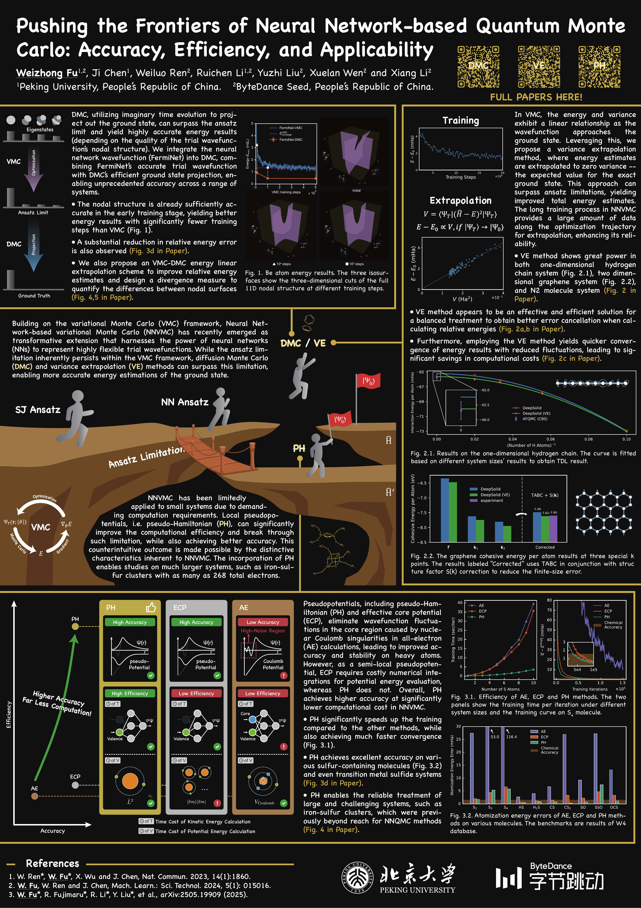

# Pushing the Frontiers of Neural Network-based Quantum Monte Carlo

**Poster presented at the Psi-k 2025 Conference**

**Authors:** Weizhong Fu1,2, Ji Chen1, Weiluo Ren2, Ruichen Li1,2, Yuzhi Liu2, Xuelan Wen2, and Xiang Li2

1 Peking University, People's Republic of China  
2 ByteDance Seed, People's Republic of China

## Poster

[**View or download the full-resolution PDF**](poster.pdf)

## Overview

This poster presents a neural network-based quantum Monte Carlo framework that combines neural network trial wavefunctions with diffusion Monte Carlo (DMC), variance extrapolation (VE), and pseudo-Hamiltonian (PH) techniques. The work addresses the accuracy, efficiency, and scalability limits of neural network variational Monte Carlo (NNVMC).

The poster highlights three directions:

- **DMC:** Improving energy estimates beyond the variational ansatz limit by projecting toward the ground state.
- **VE:** Extrapolating energy estimates to zero variance to improve relative energy estimates and convergence.
- **PH:** Reducing computational cost while maintaining high accuracy for larger and more challenging systems, including iron-sulfur clusters.

## Related work

The poster references the following publications:

1. W. Ren, W. Fu, X. Wu, and J. Chen, *Nature Communications* **14**, 1860 (2023).
2. W. Fu, W. Ren, and J. Chen, *Machine Learning: Science and Technology* **5**, 015016 (2024).
3. W. Fu, R. Fujimaru, R. Li, Y. Liu, et al., arXiv:2505.19909 (2025).
